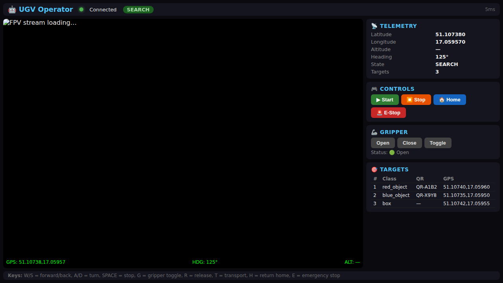

# dual-tech-2026

Competition software framework for **DUAL TECH AGH 2026** — autonomous UAV (drone) and UGV (tracked ground vehicle) that search, detect, classify, and log GPS-tagged objects in a competition field.

---
Web Gui Screenshot


---

## Project structure

```
dual-tech-2026/
├── config/                     # YAML configuration files
│   ├── common.yaml             # Shared mission settings
│   ├── uav.yaml                # UAV / ArduPilot settings
│   ├── ugv.yaml                # UGV / motor driver settings
│   ├── classes.yaml            # YOLO class map and target lists
│   └── organizer_ros.yaml      # Mirror of ROS2 bridge params (see ros2_ws)
├── ros2_ws/                    # ROS 2 Humble workspace (organizer bridge scaffold)
│   └── src/
│       ├── dt_interfaces/      # Placeholder .msg types for jury topics
│       ├── dt_organizer_bridge/# Stub publishers → replace names per spec
│       └── dt_bringup/         # organizer_bridge.launch.py + config
├── scripts/
│   └── run_organizer_bridge.sh # Source Humble + colcon build + launch
├── perception/                 # Vision pipeline
│   ├── camera.py               # OpenCV VideoCapture wrapper
│   ├── detector.py             # Ultralytics YOLO object detector
│   ├── qr_reader.py            # QR code reader (pyzbar + cv2 fallback)
│   └── fusion.py               # Detection → TargetHypothesis fusion
├── localization/               # Position and heading
│   ├── gps.py                  # NMEA GPS reader (background thread)
│   └── pose.py                 # PoseEstimator + Haversine helper
├── mission/                    # Mission logic
│   ├── state_machine.py        # Competition FSM (INIT→SEARCH→…→FINISHED)
│   ├── target_registry.py      # Deduplicating confirmed-target store
│   └── mission_manager.py      # Central mission orchestrator
├── motion/
│   └── motion_interface.py     # Abstract interface for platform controllers
├── controllers/
│   ├── uav/
│   │   └── uav_controller.py   # ArduPilot/dronekit UAV controller
│   └── ugv/
│       └── ugv_controller.py   # L298N serial UGV controller
├── logging_module/
│   └── logger.py               # CSV + JSON + image data logger
├── models.py                   # Shared data-classes
├── config_loader.py            # YAML config loader
├── main_uav.py                 # UAV mission entry point
├── main_ugv.py                 # UGV mission entry point
├── requirements.txt
└── tests/                      # pytest test suite
```

### ROS 2 — organizer-facing topics (scaffold)

The competition may require specific ROS 2 topic names and message types. This repo includes a **placeholder bridge** that publishes stub messages so you can verify DDS / `ROS_DOMAIN_ID` / tooling before wiring real data from `main_uav.py` / `main_ugv.py`.

- Edit topic names in [`ros2_ws/src/dt_bringup/config/organizer_ros.yaml`](ros2_ws/src/dt_bringup/config/organizer_ros.yaml) (and keep [`config/organizer_ros.yaml`](config/organizer_ros.yaml) in sync for reference).
- Build and run: [`ros2_ws/README.md`](ros2_ws/README.md) or `./scripts/run_organizer_bridge.sh` on a machine with ROS 2 Humble.
- Replace `dt_interfaces/msg/*.msg` with organizer-supplied types if they publish a package.

---

## Architecture overview

```
┌─────────────────────────────────────────────────────┐
│                  MissionManager                     │
│  (state machine · perception loop · logging)        │
└──────┬──────────────────────────────────┬───────────┘
       │                                  │
┌──────▼───────┐                 ┌────────▼────────┐
│  Perception  │                 │  MotionInterface │
│  ─────────── │                 │  ─────────────── │
│  detector    │                 │  UAVController   │
│  qr_reader   │                 │  UGVController   │
│  fusion      │                 └─────────────────┘
└──────────────┘
       │
┌──────▼──────────┐   ┌──────────────┐   ┌───────────────┐
│  PoseEstimator  │   │TargetRegistry│   │  DataLogger   │
│  (GPS + heading)│   │ (dedup store)│   │ (CSV/JSON/img)│
└─────────────────┘   └──────────────┘   └───────────────┘
```

### Mission state machine

```
INIT → PRECHECK → SEARCH ⇄ DETECT_CANDIDATE
                              ↓
                           INSPECT → READ_QR → CLASSIFY → REGISTER
                                                               ↓
                                                          TRANSPORT (optional)
                                                               ↓
                                                            RESUME → SEARCH
                  SEARCH → RETURN_HOME → FINISHED
    (any state) → ABORT → FINISHED
```

---

## Quick start

### Install dependencies

```bash
pip install -r requirements.txt
```

> For Raspberry Pi: `opencv-python` can be replaced with `opencv-python-headless`.

### Run tests

```bash
python -m pytest tests/ -v
```

### Run the UAV mission

```bash
python main_uav.py
```

### Run the UGV mission

```bash
python main_ugv.py
```

---

## Configuration

Edit the YAML files under `config/` before deploying:

| File | Purpose |
|------|---------|
| `config/common.yaml` | Detection confidence, confirm-frames, dedup radius, logging |
| `config/uav.yaml` | MAVLink connection, altitudes, speeds, servo PWM |
| `config/ugv.yaml` | Serial port, speeds, drop-zone GPS |
| `config/classes.yaml` | YOLO class IDs, target classes, transport classes |

Place your trained YOLO weights at `models/best.pt`.

---

## Hardware

| Component | Platform |
|-----------|----------|
| TBS Source One V5.1 5" frame | UAV |
| T-Motor VELOX V2306 1950KV (×4) | UAV |
| SpeedyBee F405 V4 BLS 55A stack | UAV |
| Foxeer M10Q-250 GPS + 5883 compass | UAV |
| RadioMaster Pocket 2.4 GHz ELRS | UAV |
| Tattu R-Line 6S 2200 mAh XT60 | UAV |
| Raspberry Pi 5 8 GB + Active Cooler | Both |
| Raspberry Pi Camera HD v2 8 MPx | Both |
| DFRobot Devastator tracked chassis | UGV |
| L298N dual motor driver | UGV |
| DC-DC step-down XL4015E1 | Both |
